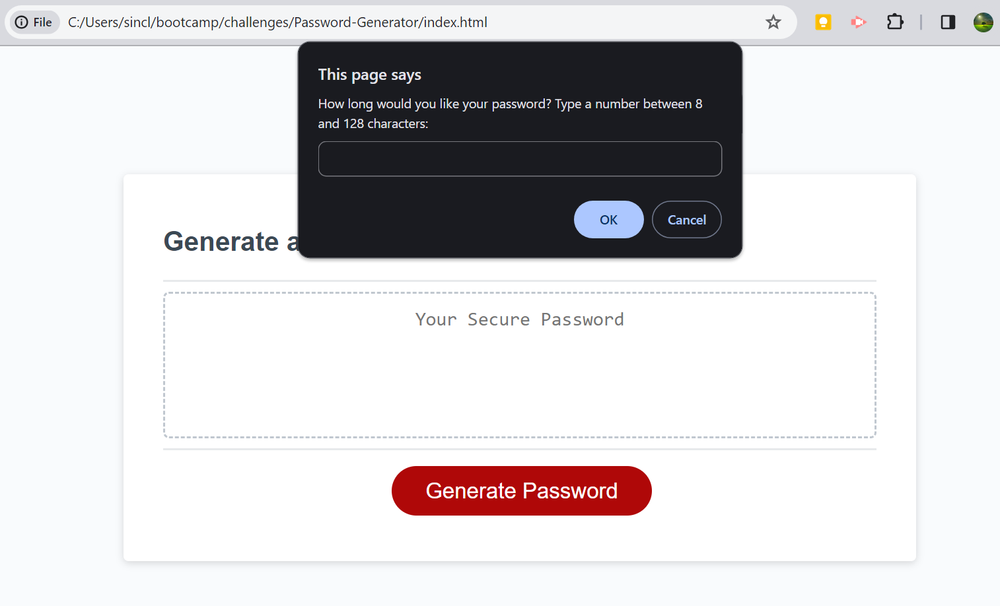

# Password Generator
A simple password generator written in JavaScript

## Description

This project was my first chance to make JavaScript work! I learned about Event Listeners and prompting, how to break down long strings, 'if' statements, and how to randomize. If I were to make another site like this, I would spend more time getting the password to appear on the page rather than only in the alert. I would also style the page a little differently; I like the look of the site in the video linked below. 

## Usage

Just click this link and try it yourself! 
https://sinclairems.github.io/Password-Generator/

Here's what it will look like. Answer the first prompt with a number like so:

    ```md
    
    ```

## Credits

For this project I referred to:
Class notes
I've been practicing JavaScript on freecodecamp.org -- JavaScript Tutorials
Too many pages to list but: MDN -- Event Listeners

This video was a huge help: https://www.youtube.com/watch?v=Xrsb9SiF3a8&t=1061s
Finally, GitHub Copilot helped me clean everything up

## License

See the included LICENSE file for details
